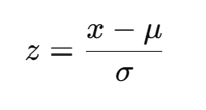
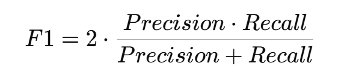

# 📊 PROJET_ML_Youtube_Trending

**PROJET_ML_Youtube_Trending** est un projet d'analyse et de prédiction de la popularité des vidéos YouTube en utilisant des méthodes d'apprentissage automatique. L'objectif du projet est d'identifier les facteurs clés qui influencent la tendance des vidéos et de construire des modèles capables de prédire la probabilité qu'une vidéo devienne populaire.

---

## 🧠 Objectifs du projet

- **Analyse des données** : Étudier les relations entre les tags des vidéos, le nombre de vues, de likes, de commentaires et d'autres caractéristiques.  
- **Prétraitement des données** : Nettoyer et préparer les données pour l'apprentissage des modèles.  
- **Construction des modèles** : Développer et entraîner différents modèles de machine learning, y compris Random Forest, MLPClassifier et XGBoost.  
- **Évaluation des modèles** : Comparer la performance des modèles en utilisant les métriques de précision, rappel et F1-score.  
- **Visualisation des résultats** : Présenter les résultats de l'analyse et de la performance des modèles avec des graphiques et tableaux.  

---

## ⚙️ Prétraitement des données  

Avant d’entraîner les modèles, nous avons utilisé **StandardScaler** pour normaliser certaines caractéristiques numériques (par ex. le nombre de vues, de likes, etc.).  

**Comment ça marche :**  


---

StandardScaler transforme chaque valeur \(x\) selon la formule :  

\[
z = \frac{x - \mu}{\sigma}
\]

où  
- \( \mu \) — la moyenne de la caractéristique  
- \( \sigma \) — l’écart-type de la caractéristique  
- \( z \) — la valeur normalisée  

Après cette transformation, les données ont une **moyenne = 0** et un **écart-type = 1**, ce qui aide les modèles de machine learning à mieux converger et améliore la performance globale.  

---

## 📌 Bibliothèques utilisées

requirements.txt  

## Résultats

- **Random Forest: F1-Score: 0.9347 (+/- 0.0190)**  
- **SVM: F1-Score: 0.8323 (+/- 0.0385)**  
- **XGBoost: F1-Score: 0.9774 (+/- 0.0155)**  
- **Neural Network (MLP): F1-Score: 0.9070 (+/- 0.0121)**  

Nous avons mentionné le F1-score, car il s'agit d'une métrique équilibrée qui combine la précision (Precision) et la couverture (Recall).  


---

## 📂 Structure du projet

```bash
youtube-popularity-ml/
│
├── archive/
│ ├── CSV
│ ├── JSON
├── image/ 
│ ├── formule_scaler.png
│ ├── formule.png
├── model/                                            
│ ├── best_youtube_classifier.pkl
│ ├── feature_scaler.pkl
├── notebook/
│ └── PROJET_ML_Youtube_Trending.ipynb #project
│
├── LICENSE
├── requirements.txt # Python dependencies
└── README.md # Documentation
```